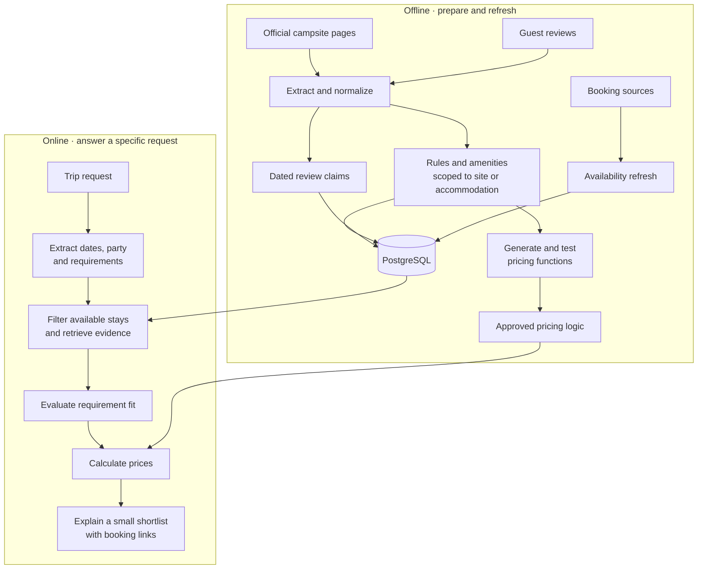
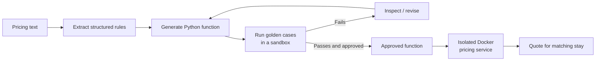

# Trippy ⛺ — a camping assistant that knows what's actually available

**[Try the demo](https://trippycamping.app/)** · **[Source code](https://github.com/simcoster/Trippy)**

Finding a campsite is easy. Finding one that's available **on your dates**, fits a group's requirements, and has the facilities people actually need is harder. Trippy combines regularly refreshed availability with structured campsite information and review evidence to recommend stays you can book, not just places that sound nice.

I love camping; I don't love coordinating a trip across everyone's dates and preferences.
The usual cycle is suggest -> search -> discover unavailablity or issues -> repeat
Trippy began as an attempt to do that research only once, keep it useful and up to date, and turn the messy discussion into a practical shortlist.

## The idea: do the slow work before the question

A general-purpose assistant can search websites and read reviews while someone waits. But much of that research is repeated for every similar request. Trippy moves extraction and normalization **offline** so the online path can focus on *this group's* constraints and *these dates*.

The LLM is used where interpretation helps. Availability filtering and approved pricing logic stay in code. The online workflow is deliberately constrained: the recommender explains candidates the planner has already checked rather than inventing new places or prices.

## Making messy information searchable

Official pages and reviews describe the same campsite in different ways. Trippy's ingestion pipeline turns them into more consistent evidence while retaining the original source wording:

- **Rules** capture restrictions, conditions and other stated facts as structured subjects with their evidence. Where applicable, they're associated with a particular accommodation type rather than the whole campsite.
- **Amenities** distinguish campsite-wide facilities from things inside a booked unit. A *shared fridge* and a *mini-fridge in the hut* shouldn't be interchangeable when someone needs the latter.
- **Reviews** become individual, dated claims about visitors' experiences. They provide context and potential contradictions, not guarantees that a facility is operating today. Reviews are searched semantically; they don't use the structured subject vectors used for rules. The available recent and relevant Google reviews are refreshed daily and accumulated over time, but the API does not provide complete review history.

At query time Trippy combines these sources to evaluate requirements such as “pools for children” or “fridge in the room,” while preserving the difference between an official listing and a guest's observation.

## Pricing rules → reusable Python

Pricing is the part I didn't want to leave to an LLM on every request. Rules can depend on dates, accommodation types, guest composition and surcharges. Instead, Trippy prepares executable pricing logic offline.

Golden cases check expected outputs before a function is approved. At request time, supported campsites can be priced by executing approved logic through a separate Docker sandbox service rather than repeatedly interpreting the original pricing prose. The aim is to make complex, group-specific pricing reusable across searches—not to claim every generated function or every site is already covered.

## Why not just use ChatGPT or Codex?

When I started Trippy, general-purpose assistants were good at suggesting *plausible* places, but I still had to verify whether a recommendation was based on an outdated blog post, whether the facilities were actually there, and whether anything was available on the dates we wanted. I wanted fewer “you should call and check” answers—and fewer browser tabs after receiving a recommendation.

General-purpose agents have improved. I tested Codex with web search and an MCP tool connected to Trippy’s availability database. It produced a useful answer without consulting Trippy’s curated facts or reviews. That challenged my assumption that the conversational workflow itself needed to be custom-built. In that particular test, though, Codex could not confidently match an available hut to its in-unit fridge; Trippy’s atomic, accommodation-scoped knowledge could. However that was test, not yet a useful benchmark.

If I started again today, I would seriously test a hosted general agent such as Codex\Claude Code as the conversational orchestrator. I would still keep the domain infrastructure that **collects facts over time, distinguishes site-wide from in-unit amenities, checks availability, and precompiles and validates pricing rules**. Combining the versatiliy a reliablity of those agents while utilizng the specificlized infra. This hosted ReACT style agent could call those specific capabilities (like the pricing sandbox) through an MCP while natively handling cases beyond search such as "why did you not pick site X and not Y?".

## Online recommendation flow

LangGraph coordinates four stages: a lightweight relevance gate, structured constraint extraction, planning, and recommendation. The planner queries availability, retrieves evidence, judges semantic requirements, and prices candidates. The final model receives a narrowed set of fits and explains the trade-offs.

## Stack

**Python · LangGraph · PostgreSQL · Alembic · FastAPI · Docker · Nebius Token Factory ·  Nebius Cloud**

The demo's UI is on Streamlit; model availability and response times can vary. This is an evolving portfolio project, not a booking provider or a guarantee of live inventory.

## Current limits and next direction

Availability is a periodically refreshed snapshot, not a booking guarantee. Review coverage is limited by the source API. Older claims about seasonal or operational facilities may need fresh confirmation. 

The next direction is **group planning via Telegram**: tracking participants' changing requirements, not part of the current demo.