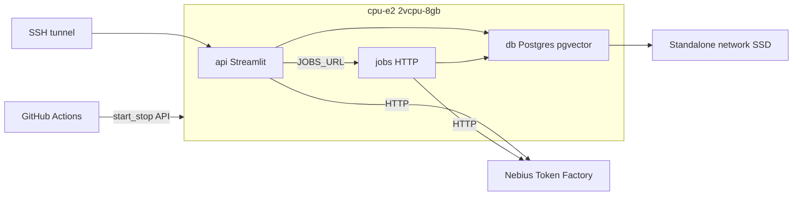

# Deploy design — Nebius VM

How Trippy is hosted, and why those choices. The click-by-click runbook is [deploy.md](deploy.md). Product semantics stay in [design.md](design.md). The later reliability target (webhook ack, session store, K8s) is [scaling.md](scaling.md); this file is what we run **now**.

## Shape

One small VM in `eu-north1`. Docker Compose: Postgres, Streamlit (LangGraph), scrape/clear worker. You create the VM in the Nebius console; the repo does not provision it. GitHub Actions only start and stop an existing instance.

No Telegram. Chat is Streamlit on loopback, reached with `ssh -L 8501:127.0.0.1:8501`.

## Why a VM, not managed Postgres or Serverless Jobs

**Self-hosted Postgres** on a disk we own, because a night stop should pause vCPU/RAM without giving the catalog to a managed instance that bills all day. pgvector is the same `pgvector/pgvector:pg16` image as local Compose.

**Not Nebius managed Postgres.** Extra product, always-on, and we already run the image locally.

**Not Serverless AI Jobs for scrapes.** Jobs are Compute VMs billed per second; CPU presets exist (`cpu-e2` in this region). Scrapes still write to *this* Postgres. If the VM is stopped, a Job has nothing to talk to unless it starts the VM first. The default job disk is 250 GiB. Token Factory is already HTTP, so ingest does not need a GPU Job. Triggering the existing CLIs on the box you already started is cheaper and simpler.

**Not Terraform.** One VM, one extra disk, one IP. Console plus the CLI cheat-sheet in the runbook is enough.

## Compute and region

| Choice | Why |
|--------|-----|
| `eu-north1` | Only public region with `cpu-e2` **2vcpu-8gb**, the cheapest CPU preset (~$0.05/h while running) |
| Regular VM, not preemptible | Preemptible is GPU-only here; a night schedule is ours, not the platform's |
| Ubuntu `ubuntu24.04-driverless` | Image for non-GPU platforms |

Sixteen hours a day plus disks is about **$1/day** infra (list USD, no VAT). Disks keep billing when the VM is stopped. Token Factory is separate and can dwarf the VM.

## Storage that survives stop

Stopped VMs are not billed for vCPU/RAM. Volumes are.

| Volume | Kind | Why |
|--------|------|-----|
| Boot ~40 GiB | Network SSD, VM-managed is fine | OS is replaceable |
| Postgres ~40 GiB | **Standalone** Network SSD, deletion protection | Lifecycle independent of the VM; reattach after a recreate |
| Job logs | Bind-mount `/var/lib/trippy/logs` on the data disk | Survive container replace |

**Never local SSD.** It is host-local and wiped on stop.

**Stop only through Nebius** (`compute instance stop`, console, or the GitHub Action). `shutdown` / `halt` inside the guest looks like a crash: Compute reboots and **keeps charging**.

A **static** public IP (not dynamic): a dynamic address is released after one hour stopped, which would break SSH and the Action. Telegram is not in play, so we do not need a domain or TLS yet.

## Network

Default security group allows everything. Assign a group that allows SSH 22 from your `/32` and egress anywhere (apt, Docker Hub, Token Factory, INPA, GitHub). Do not publish 5432, 8501, or 8080.

Streamlit listens on `0.0.0.0` *inside* the app container so Docker can forward; the **host** bind is `127.0.0.1:8501`. That is what keeps it off the public interface.

The jobs HTTP server is Compose-internal (`expose: 8080`, no `ports`). Streamlit uses `JOBS_URL=http://jobs:8080`.

## Three services, one image

Chat and ingest are different programs (LangGraph vs `just scrape-*`). They should not share a process: a long scrape would stall the chat, and stopping Streamlit would kill the child.

They **do** share an image. Both need Python, psycopg, pgvector, httpx, and the Nebius client. Two Dockerfiles would be two builds on a 2 vCPU box for little gain. Split images later if you want scrapers out of the chat image for attack surface.

| Service | Command | Role |
|---------|---------|------|
| `db` | pgvector:pg16 | Catalog. Data dir on the standalone disk |
| `api` | Streamlit | Chat + Jobs **buttons**. No scraper `Popen` when `JOBS_URL` is set |
| `jobs` | `python -m source.ops.job_server` | Runs the CLIs, one at a time (lock file) |

`just streamlit` on a laptop has no `JOBS_URL`, so the sidebar still spawns jobs in-process. Prod overlay sets the URL.

Alembic runs in the **jobs** container (`exec jobs … alembic upgrade head`): schema changes belong with ingest, not with the chat UI.

No Docker socket on the app container. Streamlit does not `docker compose run`.

## Ingest is on-demand, not cron

You press a button while the VM is up. Night stop means a 02:00 scrape has no Postgres unless we start the VM for it. Availability freshness for this catalog is a human in the day, not an hourly job yet. That is the gap vs [scaling.md](scaling.md) §4; do not pretend the schedule exists.

Clears are destructive; the UI requires a second confirm. `clear-info` passes `--yes` so it cannot hang on stdin in the worker.

## Night stop

The VM cannot start itself. GitHub Actions (Israel-ish UTC crons) call the Nebius API with a service-account authorized key.

Evening: SSH `pg_dump` to `/var/lib/trippy/backups` (and Object Storage if configured), `docker compose stop`, then `nebius compute instance stop`. Compose-stop is required because `unless-stopped` will **not** restart containers that were `docker stop`ped; morning therefore does `compose up -d` after instance start.

Weekly snapshot of the **data disk** (works while stopped). Dumps on the data disk survive even if S3 is unset. Restore: reattach the disk, or `psql` a dump. Drill that once before trusting the schedule.

The workflow is dormant until `NEBIUS_INSTANCE_ID` is a repo variable. Implementing the YAML did not create a VM.

## Out of scope (on purpose)

- Telegram webhook, ack-then-queue, persisted conversations
- Kubernetes, Redis, read replicas
- Public HTTPS / domain / Caddy
- Serverless Jobs, managed Postgres, Terraform

Those wait until this box is boring.
